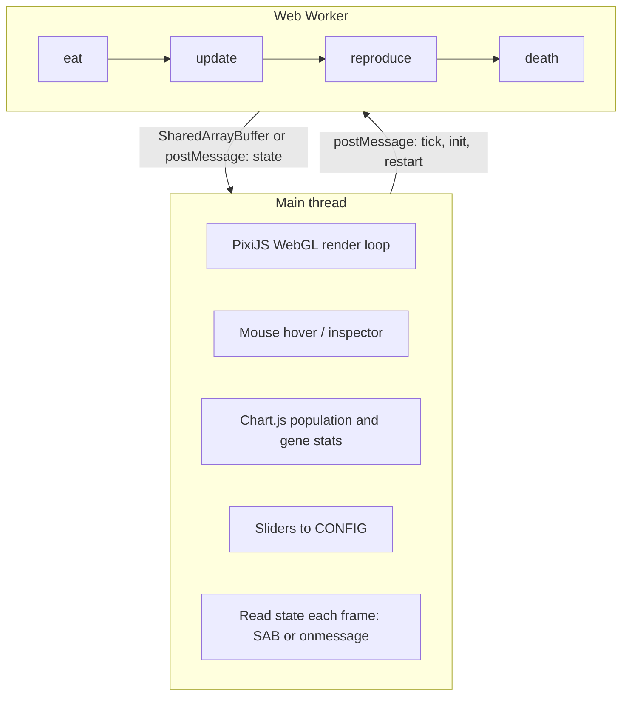

  

# 🧬 Bloid-Sim

*Blob-shaped blobs doing blob things.* Watch colorful bloids wobble, chase, munch, and evolve in a 2D arena—survival of the chunkiest, fastest, and wiggliest. Drop in, tweak the sliders, and see who thrives.

Under the hood: a browser-based predator–prey evolution simulation. Each bloid carries three heritable genes (**size**, **speed**, **angular speed**), moves around a toroidal arena, consumes smaller bloids to gain health, reproduces with mutation, and dies when health hits zero. The population evolves over time—you just set the stage.

---

## 🎮 The simulation

- **🔄 Arena** – Toroidal canvas (agents wrap at edges). Each timestep, in order:
  1. **🍽️ Eating** – For every pair, if agent A is close enough (distance &lt; A’s radius) and A is **compareCoefficient** times larger than B, A eats B: A gains `eatCoefficient × B’s HP`, B is removed.
  2. **🏃 Movement & metabolism** – Each agent updates its angle (random wiggle bounded by its angular speed), moves in that direction at its speed, then loses HP at a rate proportional to its **size** (metabolic cost).
  3. **👶 Reproduction** – Each agent has a chance `reproductionRate × dt` to produce one offspring. The child gets a copy of the parent’s DNA, then each gene may **mutate** (replace with a random value in [min, 1]) with probability **mutationRate**.
  4. **💀 Death** – Agents with HP ≤ 0 are removed. If the population ever hits zero, the sim restarts with **initialPopulation** new random agents.

**🖱️ Hover** over an individual on the canvas to highlight it (white border) and see its genes and HP in the **Inspector** panel (right drawer, below Parameters). The charts show population over time and the evolution of each gene (average, min, max).

---

## 🧪 The three genes

Each agent’s DNA is three numbers in **[0, 1]** (with minimums 0.1, 0.1, 0 for the three genes). They map to phenotype via global coefficients (sliders).

| Gene | Index | What it controls | Phenotype |
|------|--------|-------------------|-----------|
| **Size** | 0 | Body size, health pool, metabolic cost | `size = gene × sizeCoefficient`, `hp = gene × hpCoefficient`, cost per dt = `gene × costCoefficient × dt` |
| **Speed** | 1 | Movement speed (pixels per time) | `speed = gene × speedCoefficient` |
| **Angular speed** | 2 | Turn rate (how much the heading can change per timestep) | `angleSpeed = gene × 2π` (radians per timestep) |

- **📏 Size** – Larger agents have more HP and a larger “bite” radius, and can eat smaller ones (size ratio &gt; **compareCoefficient**). They also pay more metabolic cost per timestep, so they must eat to survive. **Tradeoff:** big = tanky and able to eat more, but burns HP faster and can be outmaneuvered by small, fast agents.
- **⚡ Speed** – How fast the agent moves. No direct cost; higher speed helps chase prey or flee. **Tradeoff:** fast agents cover more ground and can catch or escape others; slow ones save no energy (cost is size-based) but are easier to catch or miss.
- **🌀 Angular speed** – How much the heading randomly wobbles each step. **Tradeoff:** high = erratic, can change direction quickly to chase or dodge; low = straighter paths, more predictable movement.

🎨 Color on the canvas is gene-based: red = size, green = speed, blue = angular speed (RGB from the three genes), with opacity reflecting current HP.

---

## ⚙️ Hyperparameters and tradeoffs

### 🧬 Genetics & population

| Parameter (CONFIG key) | Range | Effect | Tradeoff |
|------------------------|--------|--------|----------|
| **Mutation rate** (`mutationRate`) | 0–0.5 | Per-gene chance that an offspring gets a new random value in [min, 1]. | Higher = more exploration and diversity, faster evolution, but more disruption of good genomes. |
| **Reproduction rate** (`reproductionRate`) | 0–0.5 | Per-timestep probability (× dt) that an individual spawns one child. | Higher = population grows and evolves faster; too high can cause boom–bust or overcrowding. |
| **Initial population** (`initialPopulation`) | 75–250 | Number of agents at start or after Restart. | Larger = more diversity and interactions; smaller = easier to watch single lineages. |

### 🔢 Coefficients (map genes to world)

| Parameter (CONFIG key) | Range | Effect | Tradeoff |
|------------------------|--------|--------|----------|
| **Size** (`sizeCoefficient`) | 25–75 | Multiplier for the size gene → display size and (with HP/cost) effective “mass”. | Higher = bigger bodies and more impact of the size gene; shifts balance toward size-based predation. |
| **HP** (`hpCoefficient`) | 75–150 | Multiplier for the size gene → starting HP. | Higher = agents live longer without eating; lower = faster turnover and stronger pressure to eat. |
| **Eat** (`eatCoefficient`) | 1–2 | Fraction of prey’s HP transferred to the eater. | &gt; 1 = eating is very rewarding; 1 = one-to-one transfer. |
| **Compare** (`compareCoefficient`) | 1–2 | Size ratio required to eat: eater must be at least **compareCoefficient** × prey’s size. | Higher = only much larger agents can eat smaller ones (stricter hierarchy); lower = more similar-sized predation. |
| **Cost** (`costCoefficient`) | 10–25 | Metabolic drain per timestep = size_gene × costCoefficient × dt. | Higher = big agents die faster without food; lower = size is less penalized. |
| **Speed coef.** (`speedCoefficient`) | 450–550 | Multiplier for the speed gene → movement speed. | Higher = speed gene has more impact; together with cost, this shapes the size–speed tradeoff. |

### 🖥️ Display & run control

| Parameter (CONFIG key) | Effect |
|------------------------|--------|
| **FPS** (`fps`) | Simulation frame rate (1–240). Affects temporal resolution and performance. |
| **Speed** (`simulationSpeed`) | Global time multiplier (1–10×). Same run, faster wall-clock time. |
| **Restart** | Resets the population to **initialPopulation** new random agents; coefficients and rates are unchanged. |

---

## 🏗️ System architecture

### Overview

The app runs simulation and rendering in parallel using a **main thread** (UI, rendering, input) and a **Web Worker** (simulation). State is passed from worker to main via **SharedArrayBuffer** (zero-copy) when COOP/COEP headers are present, or via **postMessage** (structured clone) otherwise.

### Optimizations

| Optimization | Description |
|--------------|-------------|
| **GPU rendering** | PixiJS uses WebGL. Agent circles and hover highlights are drawn with hardware-accelerated batched geometry instead of 2D canvas. |
| **Simulation on worker** | Simulation runs in a separate thread so it doesn’t block rendering or input. |
| **SharedArrayBuffer (zero-copy)** | When the page is served with COOP/COEP headers, state is shared in a `SharedArrayBuffer`. The worker writes and the main thread reads directly, avoiding structured-clone copies each tick. |
| **Double buffering** | Two SAB regions alternate: worker writes to the non-active buffer, then flips `readIndex` with `Atomics.store`. The main thread always reads from the active buffer, avoiding tearing. |
| **Fixed-timestep simulation** | Simulation ticks run on `setInterval` at `CONFIG.fps`, with `dt = simulationSpeed / fps`, independent of render frame rate. |

### SharedArrayBuffer layout

When SAB is used (`node server.js`):

- **Max agents:** 512  
- **Bytes per agent:** 44 (11 × Float32)
- **Layout:** `[readIndex: Int32] [count0: Int32] [data0: 5632 floats] [count1: Int32] [data1: 5632 floats]`
- **Fields per agent (11 floats):** `x, y, size, r, g, b, a, gene0, gene1, gene2, hp`
- **Total size:** ~45 KB

The main thread uses `Atomics.load(i32, 0)` to get the active buffer index, reads count and data from that region, and converts to drawable objects for the renderer and charts.

### Fallback

Without COOP/COEP (e.g. generic static server), `SharedArrayBuffer` is not available. The app uses `postMessage` for state instead: the worker posts `{ type: 'state', individuals: [...] }` each tick and the main thread updates render state via `onmessage`.

---

## 🚀 How to run

1. **Recommended (SharedArrayBuffer):** Run `node server.js` and open `http://localhost:8765`. The custom server sets COOP/COEP headers for zero-copy worker–main state transfer.
2. Otherwise, serve the folder with a static server (e.g. `npx serve .`) and open the URL. The app falls back to `postMessage` when SharedArrayBuffer is unavailable.

✅ No build step. Scripts: PixiJS (WebGL), Chart.js, Luxon adapters, chartjs-plugin-streaming, then the app modules. Simulation runs in a Web Worker; rendering and UI on the main thread.

---

## 📁 Project structure

- **index.html** – Page structure, script order, link to `styles.css`. Right drawer: Parameters (sliders) and Inspector (hovered individual’s genes).
- **styles.css** – Layout and dark theme (CSS variables). Game canvas fills its container; charts and details drawer on the right.
- **main.js** – Init (PixiJS renderer, simulation worker, charts), restart, hover detection, inspector. No p5; canvas is created in `js/renderer.js`.
- **js/math-utils.js** – Shared math (TWO_PI, random, vec2, dist) for main and worker.
- **js/renderer.js** – PixiJS Application, resize, draw loop; draws agents from state and hover highlight.
- **js/simulation-worker.js** – Web Worker: runs eat/update/reproduce/death; writes to SharedArrayBuffer (or posts state via postMessage).
- **js/sab-layout.js** – SharedArrayBuffer layout constants.
- **server.js** – Static server with COOP/COEP headers for SharedArrayBuffer.
- **js/config.js** – Single `CONFIG` object (e.g. `fps`, `simulationSpeed`, `initialPopulation`, `sizeCoefficient`, `hpCoefficient`, `eatCoefficient`, `compareCoefficient`, `costCoefficient`, `speedCoefficient`, `mutationRate`, `reproductionRate`) and `CONSTANTS` (`minSize`, `minSpeed`, `minAngleSpeed`, `canvasWidth`, `canvasHeight`). Sliders write to CONFIG.
- **js/controls.js** – Binds sliders and Restart button to CONFIG and display.
- **js/dna.js** – `DNA(inheritedGenes)` (genes, `mutate()`).
- **js/individual.js** – `Individual(initialPosition, dna)` (movement, eating, reproduction, `toDrawable()`, `run(dt)`). No drawing; renderer uses drawable state.
- **js/population.js** – `Population(populationSize)` (individuals list, `run(dt)`, `eat(individuals)`).
- **js/charts.js** – Population and gene charts (size, speed, angular speed). Gene charts use data-driven y-axis scaling.

📦 Dependencies (CDN): PixiJS, Chart.js, Luxon, chartjs-adapter-luxon, chartjs-plugin-streaming. Simulation worker uses `js/math-utils.js` via `importScripts`. When run via `node server.js`, SharedArrayBuffer is used for zero-copy state transfer between worker and main thread.
